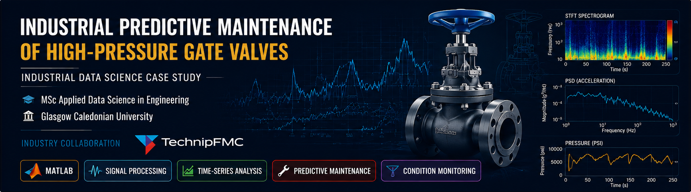
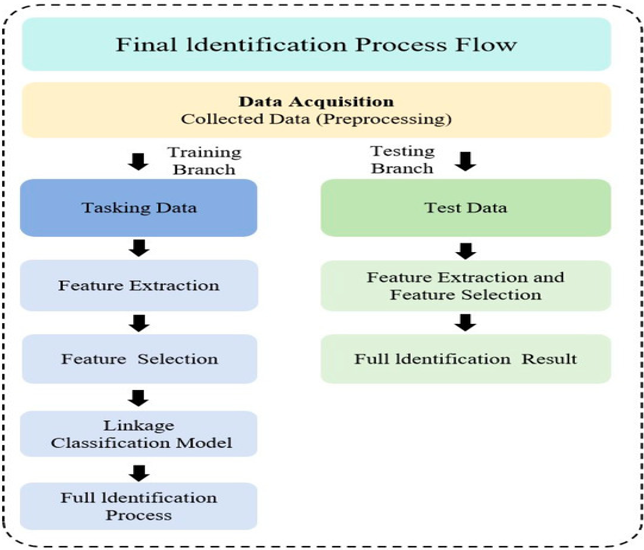
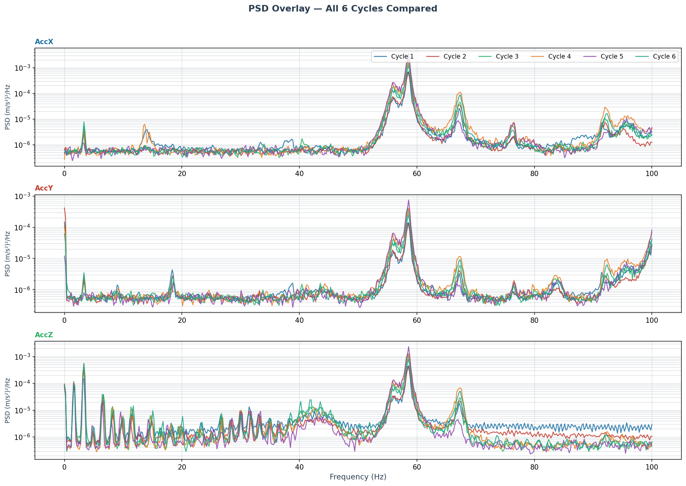
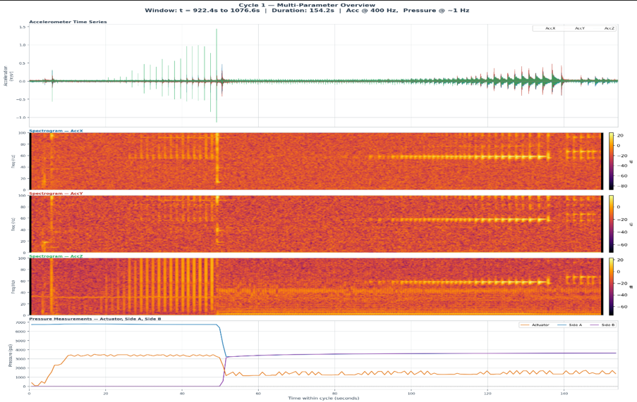
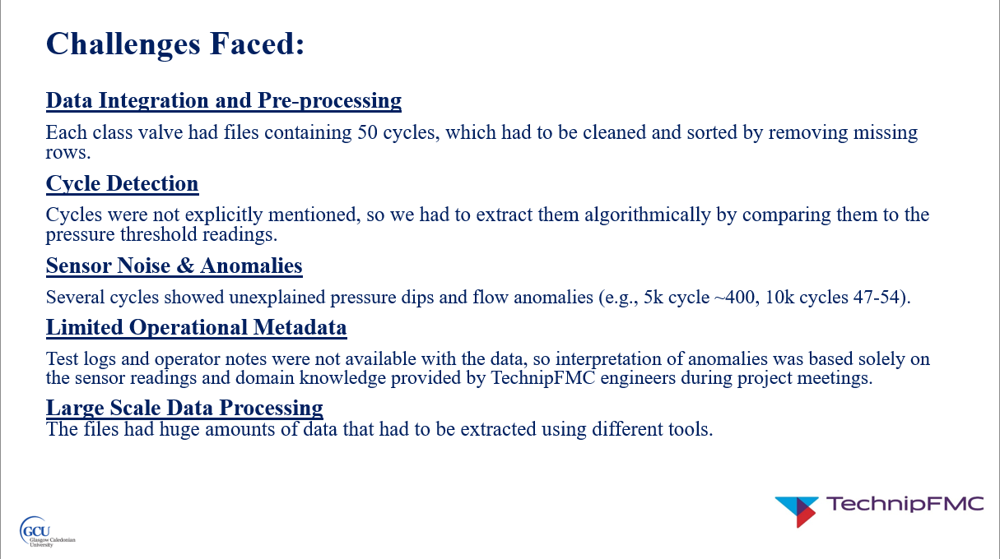

# Industrial Predictive Maintenance of High-Pressure Gate Valves

<p align="center">
  
</p>

### An Industrial Data Science Case Study using Time-Series Analysis and Advanced Signal Processing

**Degree**
MSc Applied Data Science in Engineering

**Institution**
Glasgow Caledonian University

---

## Project Overview

This project investigates how data-driven analysis can provide deeper insight into the condition and performance of industrial high-pressure gate valves.

The work was completed as part of my MSc Applied Data Science in Engineering dissertation at Glasgow Caledonian University using experimental qualification-test data provided through an industrial collaboration with TechnipFMC.

The project combines low-frequency hydraulic test data with high-frequency vibration and magnetic sensor data to identify operational trends, degradation behaviour, anomalies, and potential condition-monitoring indicators.

High-pressure gate valves are critical assets in industrial fluid systems where unexpected failures can lead to costly downtime and maintenance. This project explores how engineering data science techniques can complement conventional qualification testing by combining engineering KPIs with advanced signal-processing methods to provide deeper insight into valve behaviour, degradation trends, and predictive maintenance opportunities.

---

## Project Scope
The study analysed multiple qualification-test datasets representing different operating conditions and pressure classes. The investigation combined low-frequency hydraulic measurements with high-frequency sensor data to evaluate valve behaviour from both operational and vibration perspectives.

Two primary test programmes were analysed:

### Cyclic Pressure / Leakage Testing
- 5,000 psi gate valve
- 10,000 psi gate valve
- 15,000 psi gate valve
- 500 open-close cycles for each pressure class

### High-Frequency Vibration Testing
- 92 complete valve actuation cycles
- Tri-axial accelerometer data
- Magnetometer data
- Hydraulic pressure measurements
- Multi-day test programme

---

## Objectives

The project aimed to:

- Analyse repeated valve actuation cycles using time-series data.
- Extract engineering KPIs associated with sealing and operational behaviour.
- Identify degradation trends and anomalous operating conditions.
- Analyse high-frequency vibration signals for potential fault-sensitive characteristics.
- Investigate whether combining operational and vibration data can provide richer condition information than conventional pass/fail testing.

---

## Analytical Workflow

The analysis followed a structured engineering workflow to transform raw industrial sensor measurements into meaningful condition-monitoring insights.

The process began with inspection, cleaning, and preprocessing of multiple industrial datasets before identifying individual valve operating cycles. Cycle segmentation enabled extraction of engineering key performance indicators (KPIs), which were subsequently analysed using both time-domain and frequency-domain signal-processing techniques.

The extracted features were then interpreted from an engineering perspective to identify degradation trends, compare normal and anomalous operating behaviour, and evaluate their relevance for predictive maintenance.

The complete analytical workflow is illustrated below.

The workflow consisted of the following stages:

- Data inspection and preprocessing
- Signal cleaning and sensor alignment
- Valve-cycle segmentation
- KPI extraction
- Time-series trend analysis
- Time-domain vibration analysis
- Frequency-domain analysis
- Time-frequency analysis
- Comparison of normal and anomalous behaviour
- Engineering interpretation of the results

<p align="center">

</p>


<p align="center">
<i>Figure 1. Overall analytical workflow illustrating the data preprocessing, feature extraction, signal processing, and engineering interpretation stages used throughout the project.</i>
</p>

---

## Technologies & Methods

A combination of engineering analysis, statistical techniques, and advanced signal-processing methods was used to investigate valve behaviour throughout the qualification testing programme. MATLAB served as the primary analytical environment for preprocessing, visualisation, KPI extraction, and vibration analysis.

### Software
- MATLAB

### Data Analysis
- Time-Series Analysis
- Exploratory Data Analysis
- Cycle Segmentation
- KPI Extraction
- Data Visualisation

### Signal Processing
- Root Mean Square (RMS)
- Kurtosis
- Fast Fourier Transform (FFT)
- Power Spectral Density (PSD)
- Short-Time Fourier Transform (STFT)
- Spectrogram Analysis

### Engineering Application
- Predictive Maintenance
- Condition Monitoring
- Vibration Analysis
- Industrial Sensor Data Analysis
  
---

## Signal Processing Techniques

High-frequency vibration measurements were analysed using complementary signal-processing techniques to characterise valve behaviour throughout repeated operating cycles.

Time-domain metrics such as Root Mean Square (RMS) and Kurtosis were used to quantify vibration energy and impulsive behaviour. Fast Fourier Transform (FFT) and Power Spectral Density (PSD) analysis were used to examine frequency-domain characteristics, while Short-Time Fourier Transform (STFT) provided time-frequency representations of how vibration behaviour evolved throughout individual valve actuation events.

Together, these techniques enabled vibration characteristics to be examined alongside hydraulic and operational measurements, providing additional insight into valve behaviour and potential condition-monitoring indicators.

### Power Spectral Density (PSD) Analysis

<p align="center">
  
</p>

<p align="center">
  <i>Figure 2. Power Spectral Density analysis of high-frequency valve vibration data.</i>
</p>

### Multi-Sensor Analysis

<p align="center">
  
</p>

<p align="center">
  <i>Figure 3. Multi-sensor analysis of valve behaviour during an operating cycle.</i>
</p>

---

## Key Findings

Analysis of the hydraulic, vibration, and magnetic sensor datasets identified several significant observations across the qualification testing programme.

The principal findings are summarised below:

- The 5k valve developed clear pressure-collapse and seat-leakage behaviour during the later stages of the 500-cycle qualification test.
- The 10k valve showed a distinct operating-condition change while ultimately passing qualification.
- The 15k valve demonstrated comparatively stable performance throughout its 500-cycle test.
- Valve opening and closing durations increased across the high-frequency test programme.
- RMS, kurtosis, PSD and STFT analysis revealed differences in vibration behaviour between operating cycles.
- Early vibration cycles exhibited highly impulsive behaviour before transitioning towards more sustained broadband vibration characteristics.
- Combining cycle-level operational KPIs with vibration analysis provided more diagnostic information than a binary qualification result alone.
  
### Qualification Test KPI Trends

<p align="center">
  
</p>

<p align="center">
  <i>Figure 4. KPI trends observed during the 5k valve qualification testing programme.</i>
</p>
---

## Engineering Relevance

High-pressure gate valves are critical isolation components used in demanding industrial applications.

Developing data-driven condition-monitoring techniques for these systems could support:

- Earlier identification of degradation
- Improved maintenance planning
- Reduced unexpected failures
- Better interpretation of qualification-test results
- Future predictive-maintenance and automated anomaly-detection systems

---

## Challenges Addressed

A major part of the project involved data engineering and preprocessing.

Challenges included:

- Very large sensor datasets
- Multiple sampling frequencies
- Missing or inconsistent metadata
- Sensor bias and gravity components
- Alignment of different sensor streams
- Identification of individual valve actuation cycles
- Interpretation of anomalous operating behaviour

These challenges required development of structured preprocessing and cycle-analysis workflows before meaningful signal analysis could be performed.

### Industrial Data Analysis Challenges

<p align="center">
  
</p>

<p align="center">
  <i>Figure 5. Key data engineering and preprocessing challenges encountered during the project.</i>
</p>

---

## Future Development

Potential extensions of the project include:

- Extending vibration analysis across the complete high-frequency dataset
- Automated anomaly detection
- Machine-learning-based valve condition classification
- Multi-sensor feature fusion
- Integration of pressure and vibration signatures
- Development of a more comprehensive valve-health assessment framework

---

---

## Skills Demonstrated

- MATLAB
- Time-Series Analysis
- Signal Processing
- Predictive Maintenance
- Condition Monitoring
- Vibration Analysis
- Data Visualisation
- Engineering Data Analysis

---

## Academic & Industrial Context

| Category | Details |
|----------|---------|
| **Degree** | MSc Applied Data Science in Engineering |
| **University** | Glasgow Caledonian University |
| **Industry Collaboration** | TechnipFMC (Dissertation completed using industrial qualification-test datasets) |
| **Project Type** | MSc Dissertation / Industrial Data Analysis Project |

---

## Confidentiality Notice

This repository is intended as a portfolio-level overview of the analytical work completed during the project.

Raw industrial datasets, proprietary information, internal company documentation, MATLAB source code developed using confidential datasets, and other protected material are **not included**.

Only material suitable for public professional presentation has been shared.

---

## Repository Contents

```text
Industrial-Predictive-Maintenance-Gate-Valves/
│
├── README.md
│
├── docs/
│   ├── dissertation.pdf
│   └── presentation.pdf
│
└── images/
    └── selected-project-figures/
